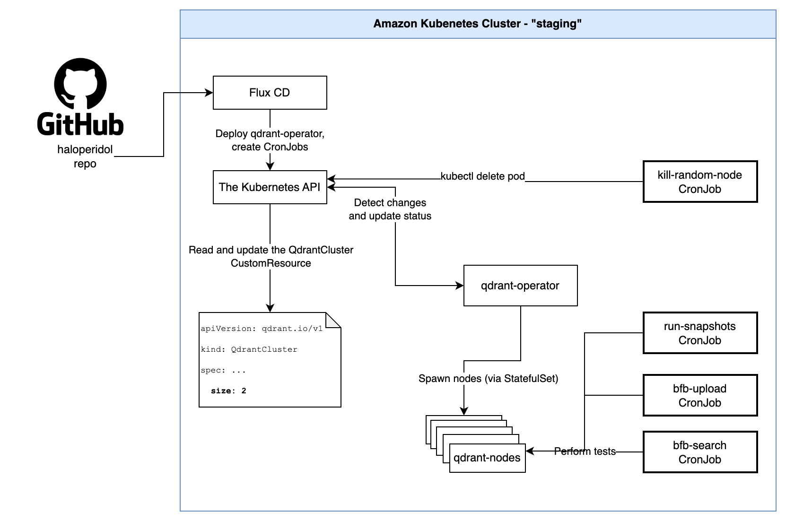

# Running Haloperidol in Kubernetes

This folder deploys Haloperidol to a Kubernetes cluster used by the cloud team called the "staging" cluster. In this cluster, we have an instance of the qdrant-operator running which allows Haloperidol to easily deploy multi-node Qdrant clusters that are exactly like ones deployed in Qdrant Cloud.

Haloperidol in Kubernetes works by executing scripts inside pods that run in the same namespace as the test Qdrant cluster. By having the right configuration on the CronJobs or Deployments that spawn these pods, the scripts can access the Kubernetes API to kill pods, modify the QdrantCluster's config, or directly run `bfb` against the Qdrant cluster via an internal DNS record that matches the Kubernetes Service and Namespace: `http://qdrant-haloperidol.haloperidol.svc.cluster.local:6333`



Any Kubernetes YAML files changed in this folder will be automatically applied
to the staging cluster when the change is committed and pushed to the "master" branch. Any new files will also be applied if added to `kustomization.yaml`.

The configuration for this can be found here: https://github.com/qdrant/qdrant-cloud/tree/main/environments/staging/apps/haloperidol

To see the rendered manifests, run this from inside this folder:

`kustomize build . | less`

## Local Testing

```
# Create a k3d cluster using these instructions: https://github.com/qdrant/qdrant-cloud/tree/main/environments/local

# Clone the qdrant-operator
git clone git@github.com:qdrant/qdrant-operator.git

# Build the operator
cd qdrant-operator/
poetry run task docker_build

# Load the operator image into k3d
poetry run task k3d_import_image

# Deploy the operator and create the namespace
helm upgrade --install qdrant-operator-haloperidol chart/ -n haloperidol --create-namespace --set image.tag=latest --set watch.onlyReleaseNamespace=true

# Come back to this repo
cd ../haloperidol/kubernetes

# Modify qdrantcluster.yaml to spawn fewer nodes, use less resources,
# and change every instance of "general-purpose-small" to "free-tier" (to match the default node taints/tolerations we use for local development).
# Otherwise the Qdrant nodes will get stuck in "Pending".
vim qdrantcluster.yaml

# Apply the modified manifests
kubectl apply -k .
```

You can trigger cronjobs to run on-demand like this:

```
kubectl create job --from=cronjob/run-snapshots test-run-snapshots -n haloperidol
```
